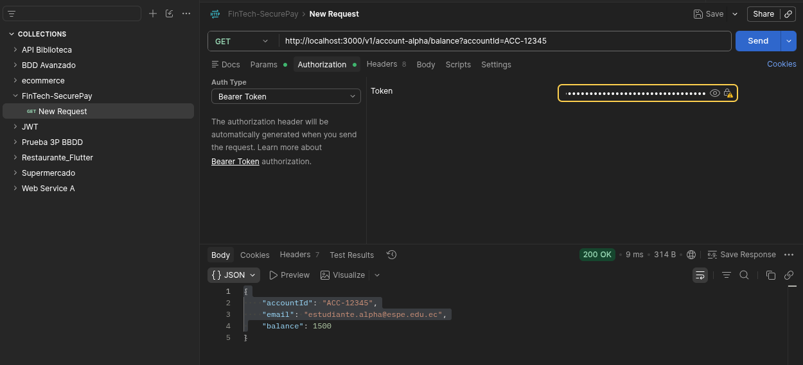
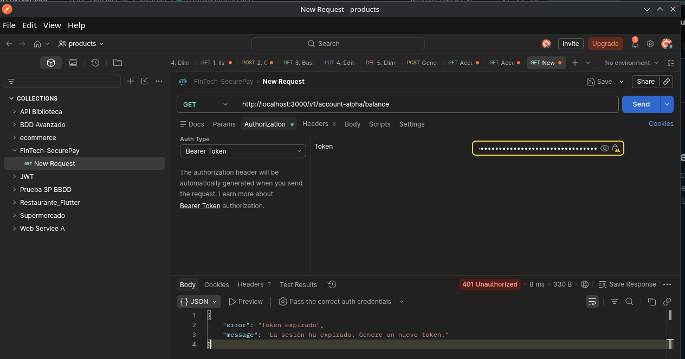
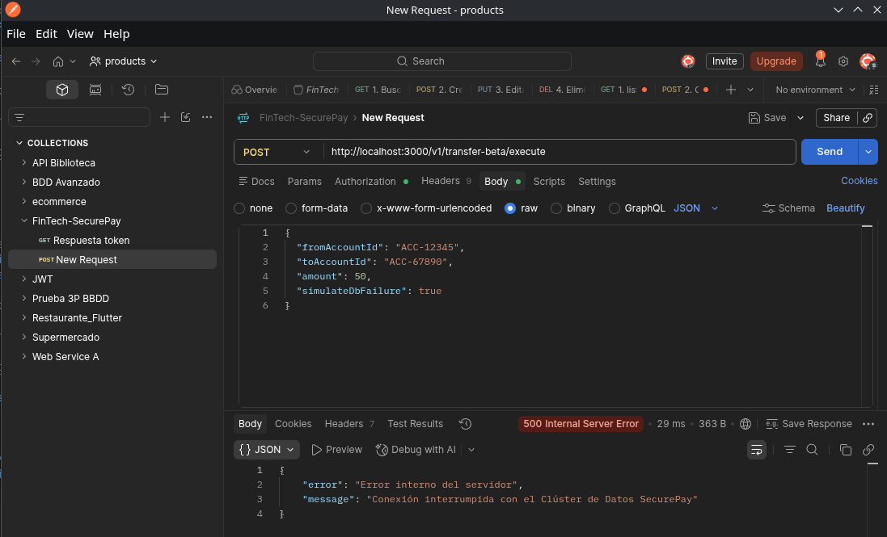
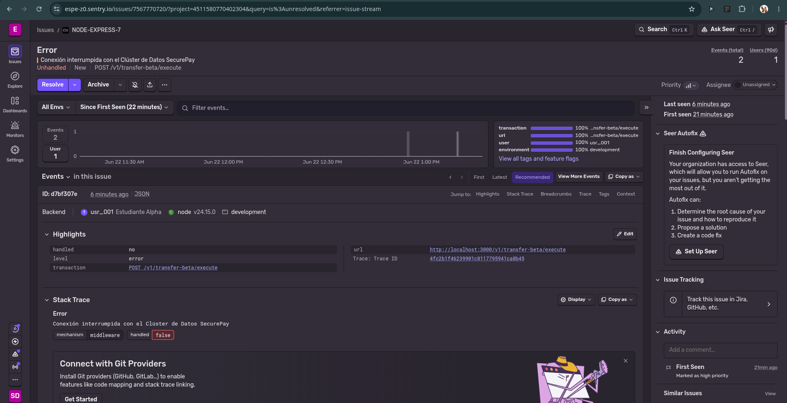
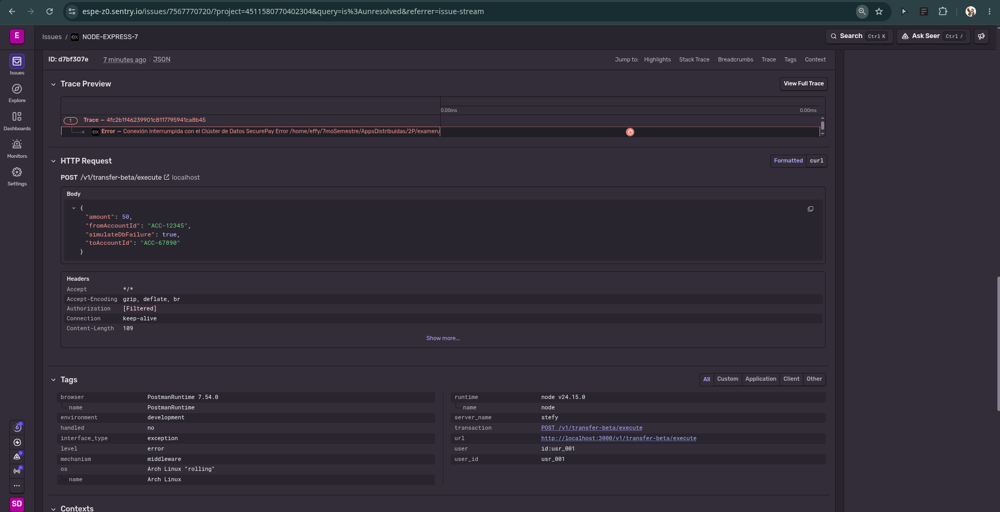

# SecurePay - Exámen 2P

## Objetivo

Este repositorio documenta la resolucion por fases de la actividad:

- Fase 1: refactorizacion SOLID con SRP y DIP.
- Fase 2: autenticacion JWT asimetrica con RS256.
- Fase 3: observabilidad con Sentry y separacion entre errores logicos y operacionales.

## Entorno

- Node.js
- Express
- JSON Web Token
- Sentry Node SDK

## Ramas Trabajadas

- `feature/01-refactor-solid`
- `feature/02-auth-jwt`
- `feature/03-observabilidad`

## Evidencias Postman

Las capturas de esta seccion corresponden a las validaciones funcionales pedidas en la actividad.

Para agilizar la validacion, los tokens usados en las pruebas se generaron por consola con comandos de Node.js. De esta manera no fue necesario esperar 2 minutos a que un token valido caducara para obtener la evidencia del `401` por expiracion.

Comandos usados:

```bash
node -e "console.log(require('./src/services/jwt.service').signToken({ id: 'usr_001', name: 'Estudiante Alpha' }))"
node -e "const fs=require('fs'); const jwt=require('jsonwebtoken'); const key=fs.readFileSync('./private.pem','utf8'); console.log(jwt.sign({sub:'usr_001',name:'Estudiante Alpha'}, key, { algorithm:'RS256', expiresIn:-10 }))"
```

### 1. Token valido y acceso autorizado

Evidencia esperada:

- Request autenticado con `Bearer <token>`
- Respuesta exitosa `200 OK`

Ruta sugerida para la captura:

- `docs/evidencias/postman/01-token-valido.png`



### 2. Token expirado

Evidencia esperada:

- Request con token expirado
- Respuesta `401 Unauthorized`
- Mensaje: `La sesion ha expirado. Genere un nuevo token.`

Ruta sugerida para la captura:

- `docs/evidencias/postman/02-token-expirado.png`



### 3. Error operacional simulado

Evidencia esperada:

- `POST /v1/transfer-beta/execute`
- Body con `"simulateDbFailure": true`
- Respuesta `500 Internal Server Error`
- Mensaje: `Conexión interrumpida con el Clúster de Datos SecurePay`

Ruta sugerida para la captura:

- `docs/evidencias/postman/03-error-operacional-500.png`



## Evidencias Sentry

Las siguientes capturas demuestran que el error operacional de la actividad fue reportado correctamente en Sentry.

### 1. Issue registrado en Sentry

Evidencia esperada:

- Issue con el mensaje `Conexión interrumpida con el Clúster de Datos SecurePay`
- Asociado al endpoint `POST /v1/transfer-beta/execute`
- Evento detectado en el proyecto instrumentado



### 2. Detalle tecnico del evento en Sentry

Evidencia esperada:

- Request `POST /v1/transfer-beta/execute`
- Body con `"simulateDbFailure": true`
- Tags y contexto del evento
- `user_id` asociado al usuario autenticado



## Requests Usados En Postman

### Token valido

```http
GET /v1/account-alpha/balance
Authorization: Bearer <token_valido>
```

### Token expirado

```http
GET /v1/account-alpha/balance
Authorization: Bearer <token_expirado>
```

### Error operacional

```http
POST /v1/transfer-beta/execute
Authorization: Bearer <token_valido>
Content-Type: application/json
```

```json
{
  "fromAccountId": "ACC-12345",
  "toAccountId": "ACC-67890",
  "amount": 50,
  "simulateDbFailure": true
}
```

## Resultado

Se validaron correctamente los tres escenarios principales de la actividad:

- acceso autorizado con token valido
- rechazo por token expirado
- captura del fallo operacional `500` en Sentry con contexto de usuario
